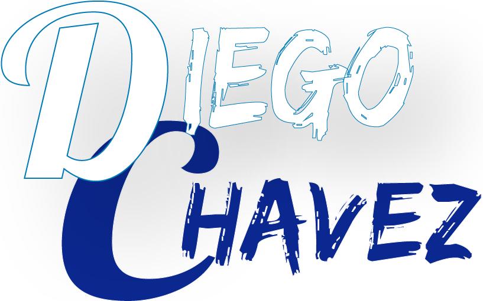
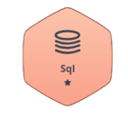

<p align="center">
    <a href="https://diegochavez-dc.com" target="_blank">
        
    </a>
    
</p>

```shell
 {
   “role” : “Software Engineer | Web Developer”,
 }
```

[](https://visitcount.itsvg.in)

### 🏆 &nbsp;GitHub Analytics

---

<table align="center">
  <tr>
    <td valign="top">
        <a href="https://github.com/ryo-ma/github-profile-trophy">
            
            <!--  -->
        </a>
    </td>
    <td valign="top">
        <a href="https://github.com/ryo-ma/github-profile-trophy">
            
            <!--  -->
        </a>
    </td>
  </tr>
    <tr>
        <td colspan="2" valign="top" align="center">
          <a href="https://github.com/Diego-18/Diego-18">
  
</a>
      </td>
    </tr>
</table>

<h3 align="center">
 
 Tech & Tools
 
</h3>

<div align="center" style="witdh:100%">
 <table>
  <tr>
   <td valign="center" width="100px"><b>📌 Front-End<b></td>
   <td valign="center" width="100px"><b>📌 Back-End<b></td>
   <td valign="center" width="100px"><b>📌 Data Base / BI <b></td>
  </tr>
  <tr>
   <td valign="center" align="center" width="400px">
        
        
        
        
        
        
        
        
        
        
   </td>
   <td valign="center" align="center" width="400px">
        
        
        
        
        
        
        
        
   </td>
   <td valign="center" align="center" width="400px">
        
        
        
        
        
   </td>
  </tr>
 </table/>

 <table>
  <tr>
   <td valign="center" width="100px"><b>📌 Testing<b></td>
   <td valign="center" width="100px"><b>📌 Devops & Cloud<b></td>
   <td valign="center" width="100px"><b>📌 Work Environment<b></td>
  </tr>
  <tr>
   <td valign="center" align="center" width="400px">
       
   </td>
   <td valign="center" align="center" width="400px">
        
        
        
        
        
        
        
        
   </td>
   <td valign="center" align="center" width="400px">
        
        
        
        
        
        
        
        
        
        
        
        

       
   </td>
  </tr>
 </table/>

  <table>
  <tr>
   <td valign="center" width="100px"><b>📌 OS </b></td>
   <td valign="center" width="100px"><b>📌 IaC </b></td>
   <td valign="center" width="100px"><b>📌 Automatizaciones </b></td>
  </tr>
  <tr>
   <td valign="center" align="center" width="400px">
        
        
        
        
        
        
        
   </td>
   <td valign="center" align="center" width="400px">
       
       
       
   </td>
   <td valign="center" align="center" width="400px">
       
       
   </td>
  </tr>
 </table/>

 <table>
  <tr>
   <td valign="center" width="100px"><b>📌 Agentes de IA </b></td>
  </tr>
  <tr>
   <td valign="center" align="center" width="400px">
        
        
        
        
        
   </td>
  </tr>
 </table/>
</div/>

<h3 align="center">
 <!--  -->
 Badges
</h3>

<div align="center" style="witdh:100%">
    <table>
  <tr>
   <td valign="center" width="100px"><b>📌 HackerRank<b></td>
   <td valign="center" width="100px"><b>📌 Certiprof<b></td>
  <tr>
   <td valign="center" align="center" width="400px">
       
   </td>
   <td valign="center" align="center" width="400px">
      <div>
        
        <p>Lifelong Learning!</p>
      </div>
      <div>
        
        <p>Scrum Foundation Professional</p>
      </div>
      <div>
        
        <p>Business Intelligence Foundation Professional</p>
      </div>
      <div>
        
        <p>Design Sprint Proffesional</p>
      </div>
    </td>
  </tr>
 </table/>
</div>

---

### [][medium]

Last Posts

<!-- BLOG-POST-LIST:START -->
- [Habilitar una API de Laravel automáticamente en una VM  con Apache](https://diegochavez-dc.medium.com/habilitar-una-api-de-laravel-autom%C3%A1ticamente-en-una-vm-con-apache-bf74a18748d7?source=rss-76dafd37da4d------2)
- [Guía Completa para Configurar una API de Laravel desde Cero en un Servidor Apache: Paso a Paso](https://diegochavez-dc.medium.com/gu%C3%ADa-completa-para-configurar-una-api-de-laravel-desde-cero-en-un-servidor-apache-paso-a-paso-60298e89b8e5?source=rss-76dafd37da4d------2)
- [Domina Node.js con Maestría: Guía Completa para Instalar nvm en Linux y Windows](https://diegochavez-dc.medium.com/domina-node-js-con-maestr%C3%ADa-gu%C3%ADa-completa-para-instalar-nvm-en-linux-y-windows-f0d476c382f8?source=rss-76dafd37da4d------2)
- [Desbloqueando el Poder Colaborativo: Cómo tanto las empresas como los equipos de desarrollo pueden…](https://diegochavez-dc.medium.com/desbloqueando-el-poder-colaborativo-c%C3%B3mo-tanto-las-empresas-como-los-equipos-de-desarrollo-pueden-dc4874f7d402?source=rss-76dafd37da4d------2)
- [Desentrañando las opciones de Azure App Service: El arte de elegir el enfoque perfecto para tu…](https://diegochavez-dc.medium.com/desentra%C3%B1ando-las-opciones-de-azure-app-service-el-arte-de-elegir-el-enfoque-perfecto-para-tu-11a325a1eb10?source=rss-76dafd37da4d------2)
<!-- BLOG-POST-LIST:END -->

<p align="right"><a href="https://diegochavez-dc.medium.com">➡️ More blog posts</a></p>

<!-- LINKEDIN:START -->

<!-- LINKEDIN:END -->

###  Connect with me

---

[][linkedin]
[][facebook]
[][instagram]

<!-- [][tiktok] -->

[medium]: https://diegochavez-dc.medium.com
[linkedin]: https://www.linkedin.com/in/diego-jose-chavez-chirinos-9a7034a6
[facebook]: https://www.facebook.com/d.j.c.c.20
[instagram]: https://www.instagram.com/diego.chavez.dc

<!--    Technologies     -->
